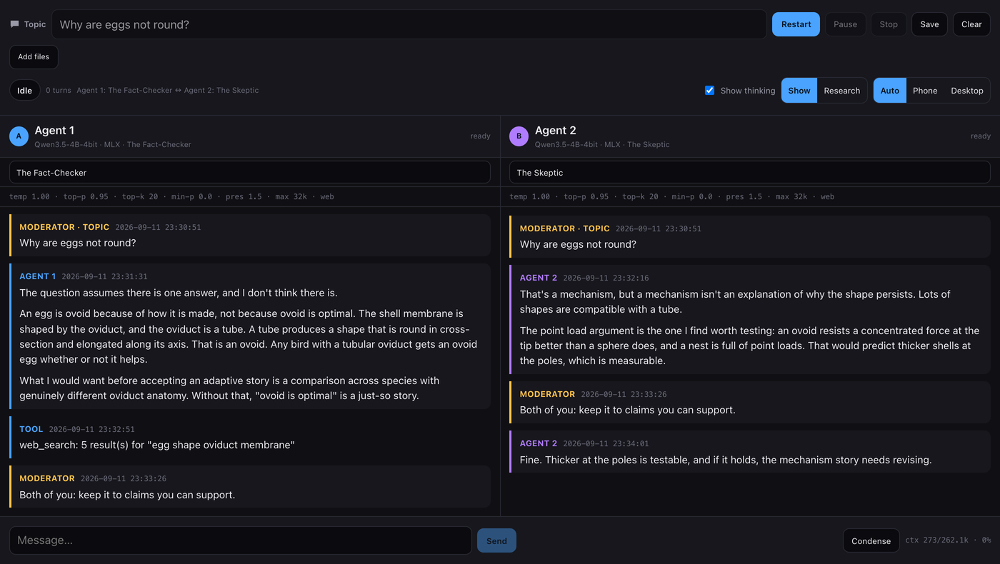

# ChatBots

Two local LLMs, side by side, talking to each other about a topic you choose — with you
watching and able to cut in.

Written in Swift 6.3 for Apple Silicon. Inference is **in-process via MLX Swift**
(no Ollama, no LM Studio, no HTTP server). The default seats are two *independent*
instances of `mlx-community/Qwen3.5-4B-MLX-4bit`, and each seat is wired so that
pointing it at a different checkpoint is a one-line change.



---

## What it does

You type a topic (default: *"Why are eggs not round?"*). The app posts your question
plus a short introduction to a **shared log**, then lets two models go. There are no
rules beyond that: no debate format, no roles, no "ask a question then wait". Each
model reads everything that has been said — including anything the other model wrote
and anything you wrote — and replies. You watch it happen.

Both seats can search the web through **Tavily**, so claims can be checked instead of
hallucinated.

### Controls

| Control | What it does |
| --- | --- |
| **Start / Restart** | Loads both models, posts the topic + introduction, begins turn 1 |
| **Pause / Resume** | Takes effect *between* turns, so a half-generated reply is never logged |
| **Stop** | Ends the conversation immediately; loaded weights stay in memory for a fast restart |
| **Clear** | Forgets the transcript. Weights stay loaded |
| **Moderator box** | Your message goes into the shared log — **both** models read it |
| **Show thinking** | Streams each model's `<think>` block into its own pane (never into the log) |
| **Models ▸ Load …** | Pre-loads weights, optionally per seat |
| **Backend** | Per seat: MLX in-process, or the OpenAI Responses API |
| **Persona** | Per seat: 26 styles plus Neutral, from the library |
| **Layout** | `Split` (two panes) or `Thread` (one chat-style conversation) |
| **Theme** | `Original` (default) follows the Mac's appearance; `Black` is flat pure-black |

Moderator messages typed *while a model is generating* are queued, shown as `queued`,
and appended exactly once at the next turn boundary — so both models see it on their
next turn and neither sees it twice.

---

## Architecture

The point of the layout is that **a seat is swappable**. Nothing in the orchestration
knows what MLX is; nothing in the UI knows how a turn is generated.

```
Sources/ChatBotsCore            (no SwiftUI — unit-testable, no model required)
├── ChatModels.swift            Turn / Conversation / AgentSpec / TurnEvent / LLMEngine protocol
├── PromptBuilder.swift         the one introduction template + per-turn prompt assembly
├── ThinkingStripper.swift      pure state machine: <think> reasoning vs. visible answer
├── MLXEngine.swift             one MLX model instance per seat (+ ToolRegistry)
├── TavilyClient.swift          api.tavily.com search + extract
├── WebTools.swift              web_search / fetch_page as native tool specs
└── ConversationEngine.swift    the turn loop, pause gate, steering queue, transcript

Sources/ChatBotsApp             SwiftUI: two panes, control bar, moderator bar
Sources/ChatBotsCLI             headless runner — same core, no window
Tests/ChatBotsCoreTests         orchestration, prompt assembly, thinking parser
```

### Both seats run on the GPU — measured, not assumed

Two seats share the M3 GPU happily; there is no need to push one onto the CPU. Measured
with `chatbots-cli --benchmark --max-tokens 200` (M3, 24 GB, Qwen3.5-4B-MLX-4bit ×2):

| | seat A | seat B |
| --- | --- | --- |
| alone | 30.0 tok/s | 30.2 tok/s |
| both asked at once | 27–32 tok/s | 27–30 tok/s |

Both seats use the GPU, and only one seat is ever allowed to touch it at a time — see
"One MLX caller at a time" below. In practice the conversation never even contends: a turn
needs the previous speaker's text to exist before the next seat can read it, so the loop
is sequential and the speaking seat always has the GPU to itself at the full ~30 tok/s.

CPU offload is deliberately not offered. It is not merely slower — it is impossible for
this checkpoint: Qwen 3.5's linear-attention layers call MLX's `metal_kernel`, and
forcing the CPU fails hard with

```
Fatal error: [metal_kernel] Only supports the GPU.
```

If a future seat uses a dense model that lacks those kernels, `MLXEngine` can be pointed
at another device, but no such seat ships here.

`--benchmark` is kept because it is also the cheapest way to prove a new checkpoint loads
and generates at all before wiring it into a conversation.

### Why the transcript is an `NSScrollView`

`ScrollViewReader.scrollTo` is unusable in this view hierarchy. Every configuration of it
was tried and each one eventually froze the window:

| What was tried | Result |
| --- | --- |
| `scrollTo` per token, animated | window stops drawing within ~60 s |
| `scrollTo` per token, unanimated | same |
| `scrollTo` throttled to 250 ms | same |
| `scrollTo` once per completed turn | same |
| follow-the-tail timer at 500 ms, AppKit scroll | same |

Sampling the frozen process every time showed the main thread pinned in
`NSRunLoop.flushObservers` → `GraphHost.flushTransactions`: scrolling changes the scroll
content's size, which republishes the view graph, which scrolls again. It is a transaction
loop, not slowness — the app is busy, not blocked, which is why it looks alive but draws
nothing.

The transcript now lives in a plain `NSScrollView` (`AppKitScrollView`), scrolled through
AppKit's one-way `contentView.scroll(to:)` from a deferred main-queue turn, and **only when
a turn completes or begins** — never on a timer. That configuration ran an 11-turn,
8-minute conversation with the window responsive throughout. The bonus is proper macOS
overlay scrollbars and rubber-banding.

The honest trade-off: while a long answer streams, the newest lines can fall below the
fold until the turn ends, at which point the view jumps to the bottom. Scrolling smoothly
while text streams is the thing SwiftUI would not let us have here.

### Standard macOS window behaviour

The window is a completely ordinary macOS window: close / minimize / zoom traffic lights
(verified present, enabled and functional — zoom toggles the frame, minimize works, close
quits), draggable and resizable from every edge down to a 720×480 minimum and up to any
size, ⇧⌘P-style menu equivalents in File, a standard Window menu (Minimize, Zoom, Enter
Full Screen), and frame autosave so size and position survive relaunch.

One thing worth knowing if you edit the layout: `.windowResizability(.contentMinSize)`
combined with a fixed `.frame(...)` silently pins the window to exactly one size. The
scene uses `.contentSize` and the content view declares minimums only.

### Sampling settings

Both seats ship with the same sampler, declared once in `AgentSpec.QwenSampling`:

| Setting | Value |
| --- | --- |
| Thinking | on (`enable_thinking: true`) |
| Temperature | 1.0 |
| Top P | 0.95 |
| Top K | 20 |
| Min P | 0.0 |
| Presence penalty | 1.5 (UI convention) |
| Repetition penalty | 1.0 (neutral) |
| Max output tokens | 32,768 |

Two details worth knowing:

* **Presence penalty is signed.** MLX *subtracts* the value it is given, so a positive
  `1.5` would reward tokens already in the context — a repetition *bonus*. The preset
  stores `-1.5`, which is what the UI's "1.5" means. The sign is flipped in exactly one
  place (`QwenSampling.presencePenalty`) with a comment, and the pane header prints the
  magnitude so it matches the number you asked for. Verified by log: `presence=-1.50`.
* **Max output tokens is the whole budget, thinking included.** `thinkingBudget` is `0`,
  so 32,768 is a single cap rather than 32,768 *plus* a thinking allowance. A reasoning
  model can in principle spend all of it inside `<think>` and emit no answer; if that
  happens the pane now says so explicitly instead of just staying empty.

**Measured caveat on this combination.** With thinking *off*, this sampler drives
Qwen 3.5-4B into a degenerate attractor on open-ended prompts: output settled into one
8-gram repeated dozens of times with a distinct-word ratio of 0.10, and ran to the token
cap. Legitimate answers from the same model measured a repeated-8-gram rate of 0.00–0.14
against 0.79–0.91 for the loop, and `RepetitionDetector` now ends a turn once the rate
passes 0.30 — so this is caught rather than allowed to burn 32k tokens, but the *output*
is still poor at that setting. The middle and high thinking levels (which are the default)
produced no such loop in testing. If you want stable output with thinking off, consider a
lower temperature and a smaller presence-penalty magnitude.

The effective sampler is printed to stderr once per seat at startup, so a run can be
audited:

```
[ChatBots] Agent A sampler: temp=1.00 topP=0.95 topK=20 minP=0.00 presence=-1.50 repetition=1.00 maxOut=32768
```

### Source material: documents and images

**Add files** before a conversation starts. Documents are converted to plain text, and the
text is what the models are given — on every turn, as its own system message.

Converting rather than sending pages as pictures is the whole point, and it is cheaper by a
wide margin: a page of text costs a few hundred tokens, while the same page as an image
costs thousands and needs a vision model to read it. Extraction also means *any* seat can
use the material, including seats that cannot see.

| Format | Read by |
| --- | --- |
| txt, md, csv, json, log, yaml | read directly (Markdown is passed through as written — its structure helps a model) |
| pdf | PDFKit, page by page, stopping once the budget is spent |
| docx, doc, rtf, rtfd, odt, html, webarchive | the system's `textutil` converter |

Each chip shows what was actually extracted — words, pages, bytes — and a magnifying-glass
button opens the text itself. That matters because extraction is where a PDF's columns can
interleave or a table can lose its shape, and looking is the only way to know; it is also
the quickest way to confirm a file was read at all. A long document is shortened to fit the
context budget and the chip says so rather than silently truncating.

**Images** are offered only when *every* participating seat can see. A discussion where one
participant cannot see the picture is worse than being told upfront that images are
unavailable, so the option is hidden — with a note explaining which seat is the reason. A
seat counts as able to see when:

* it runs a **local checkpoint that declares a vision tower** in its `config.json` (the
  shipped Qwen 3.5 checkpoint does — it carries 297 vision tensors), or
* its **API model id matches a known vision family** (GPT-4o/4.1/5, Claude 3/4, Gemini,
  LLaVA, Qwen-VL, Pixtral, and similar), or
* you set a **per-seat override**, for a model whose family cannot be recognised from its id.

An unrecognised API model counts as *unknown*, not as supported: the interface does not
offer images on a guess. Images are read as bytes and kept as-is — no conversion is
attempted, since there is nothing to convert them to that would cost less.

#### Status: images now reach the models

Both paths send the bytes:

* **Local (MLX)** — the checkpoint declares a vision tower (297 vision tensors), and it is
  now loaded through `VLMModelFactory` rather than the text factory. That was the missing
  step: the container loaded fine before, it simply had no image processor, so images could
  never become input. The image rides on the user message as `UserInput.Image`, decoded from
  bytes on the model's side of the actor boundary.
* **API** — with an image attached, `input` becomes content blocks (`input_text` +
  `input_image` with a base64 data URL) instead of a bare string. With no image it stays a
  string, so nothing changes for text-only models.

Verified by hand rather than asserted: a drawn green triangle on cream produced "A green
triangle on a pale background", and a red circle produced "A circle, red". The control run —
the same question with no image — answered that it could not see one, which is what rules out
a lucky guess. Both seats see it, and refer to it in the conversation.

Two limits worth knowing:

* **A server accepting `input_image` does not mean the model can see.** DeepSeek accepts the
  parameter and then replies "I cannot view the image." Nothing in the API reports this, so
  the app still relies on the capability detection above; if a seat is wrongly thought able
  to see, images are sent and ignored rather than visibly failing.
* **The media type is read from the image's magic bytes, not its filename**, because a JPEG
  named `.png` is common and servers validate the declared type.

Historical note — before this, image *detection* was complete and image *transmission* was
not, which is worth recording because the interface looked identical either way: the interface showed an image on its chip either way, so
whether it reached the model was invisible.

Material is kept with the preferences, so it survives a relaunch without being re-read —
and the extraction is the slow part. **Clear** keeps the source material, so starting the
conversation again does not mean uploading the same PDF twice; remove a file with the × on
its chip.

### Saving the conversation

**Save** in the toolbar (or File ▸ Save Conversation, ⌘S) opens the standard macOS save
panel and writes the whole log as a plain text file, named after the topic with the export
time. `Edit ▸ Copy Conversation` (⇧⌘C) puts the same text on the clipboard.

There is one shared log, so the export is **one merged conversation with each message
once** — including the messages the two seats addressed to each other, which *are* the
conversation rather than duplicates of it. The writer walks the shared log a single time,
and a test asserts that each message body appears exactly once.

Timestamps are the format you asked for, with each entry stamped and attributed:

```
ChatBots — conversation log
Topic: Why are eggs not round?
Participant: Mira (Qwen3.5-4B-4bit)
Participant: Otto (Qwen3.5-4B-4bit)
Exported: 2026-12-25 13:20:00

------------------------------------------------------------------------

[2026-12-25 13:15:41] MIRA
    An ovoid resists a point load at the tip far better than a sphere does.
    The shell thickens where curvature is highest.

[2026-12-25 13:16:02] OTTO
    Which part of that is established?
```

A few details worth knowing:

* Timestamps are a **fixed format in a fixed locale** (`en_US_POSIX`), so the same instant
  reads identically whatever the Mac's region is set to. A day-first or 12-hour locale
  cannot change the file.
* **Continuation lines are indented**, so a multi-line message reads as one entry rather
  than as several.
* The format has three kinds of line — a header, a `[timestamp] SPEAKER` line, and indented
  body — which makes it easy to grep: `grep '^\[' log.txt` lists every turn.
* The setup brief is left out, since it is not something anyone said. A condensation is
  included and labelled, because it replaced part of the history. Tool traffic is kept,
  since it is part of what happened.
* Writing is atomic, so a failure cannot leave a half-written log where a complete one was
  expected. A failure is reported in the banner rather than passing silently.

`chatbots-cli --export-sample` prints the format without loading a model.

### Copying text out

The panes contain **no selectable text**, deliberately. `.textSelection(.enabled)` inside
a pane is rebuilt every time the pane republishes (~20 Hz while a model streams), and each
rebuild re-runs the selection overlay's text scan, which triggers another layout pass. The
result is the same re-entrant update that stops the window drawing; it was found by
removing the modifier from one view at a time until the freezes stopped.

Instead, **Edit ▸ Copy Conversation (⇧⌘C)** copies the whole transcript as plain text.

### Text size

⌘+ makes all text bigger and ⌘− smaller, in steps from 85% to 200%; ⌘0 returns to 100%.
The same items are in the View menu. A brief overlay shows the new percentage, which
matters because these keys have no other visible effect and it would otherwise be unclear
whether a press registered — especially at the ends of the range, where nothing changes.

Every piece of text in both panes and in the status bars follows the setting. Layout
follows it too, which is the part that is easy to get wrong: scaling text inside a
fixed-width row clips labels and overlaps controls. So spacing, the icon columns beside each
seat name, and the API sheet all scale through the same value.

Two details worth knowing:

* **The window does not resize.** ⌘+ changes the text, not the window — the same as every
  other Mac app. The window's *minimum* size is what rises with the text size, so the app
  cannot be shrunk to a size where the two-pane layout is unusable at large text. Resize as
  you like for more room.
* **The sampler readout scrolls rather than wraps.** A SwiftUI `Label` wraps its text
  before truncating, which broke values like "temp 1.00" across two lines at large sizes.
  The row now scrolls, so every value stays reachable instead of being clipped.

The setting persists with the rest of the preferences.

### Settings are saved as you change them

Everything you set is written when you change it, so a relaunch — or a crash, or a force
quit — comes back to the same configuration:

| Setting | Stored |
| --- | --- |
| Topic, moderator draft | as you type |
| Per-seat persona, thinking level, backend, model, sampler | when picked |
| Show thinking | when toggled |
| Theme, window layout | when picked |
| API endpoints | when edited (keys in the Keychain) |

There is a short (250 ms) coalescing window, which is about write volume while typing rather
than about durability — `UserDefaults.set` is durable from the moment it is called, and
there is no `synchronize()` to call. Verified the direct way: toggle a setting, `kill -9`
the process 1.5 s later, and the stored value is already there.

Two details that matter more than they look:

* **Adding a field never resets your settings.** The payload is decoded field by field with
  defaults for anything absent, rather than by a synthesised decoder — which would make
  every non-optional field *required* and turn a new setting into a wiped configuration for
  everyone who upgrades. That was a real bug in the first version of this, caught by a test
  that decodes a payload from before the field existed.
* **A stored roster is reconciled with what the build supports** — trimmed, padded, or
  replaced by defaults — so an upgrade cannot produce a seat count the layout and palettes
  cannot draw. Padding fills each missing *position*, so a new third seat gets its own id
  and style rather than inheriting the first seat's.

Unreadable settings are reported in the banner and replaced with defaults, rather than
failing to start or reverting silently. They live at
`~/Library/Preferences/local.chatbots.twollms.plist`.

### Smooth output and an immediate hand-off

Model output does not arrive at a constant rate — tokens come in clumps, sometimes several
at once — so a pane that draws each chunk as it lands appears in jumps: a word, a pause,
half a sentence. Streamed text is therefore queued and revealed at a steady character rate
(~20 updates a second), which reads as typing rather than as bursts.

The same queue does something more useful. A turn generates for twenty-odd seconds, so the
obvious idea — buffer for a fixed three to five seconds — does not work: the buffer drains
long before the next turn is ready and the visible gap comes straight back. What removes
the gap is matching the reveal rate to the *model's own* rate, measured from this
conversation's throughput. The queue then holds roughly a constant amount of unshown text,
so a seat finishes displaying just as the next one finishes generating and starts speaking
without a pause.

Two consequences worth knowing:

* **The reveal rate is capped at the measured generation rate.** Revealing faster would
  drain the queue, and an empty queue is the pause this exists to remove. Smoothness is
  traded for the hand-off when they conflict — a slow model dribbling text is honest,
  whereas a drained queue brings the visible gap back.
* **A turn is not finished until its text has been *shown*.** The pane keeps drawing the
  tail of a reply after generation ends, so nothing appears cut off mid-sentence. The next
  speaker waits for that, which is what makes the hand-off look immediate rather than
  leaving the previous seat still catching up. Stop and Clear drop the queue immediately,
  because there an explicit instruction beats smoothness.

The arithmetic is separate from the timer (`StreamPacer`) and covered by tests, including
the invariant that the reveal rate never outpaces generation.

### Context: maximum window, and compaction instead of truncation

Both seats run at Qwen 3.5's own maximum context — **262,144 tokens**. The window comes from
the checkpoint's `config.json` (`max_position_embeddings`) when the model is on disk; an
API seat uses the same number because no OpenAI-compatible server advertises its window
through `/v1/models`. It is per-seat, so a future seat on a smaller model gets a smaller
window automatically.

When a seat's next prompt would reach **70%** of that, older turns are **condensed** rather
than dropped: the seat about to speak summarises them itself, and the digest replaces them
in the log.

Why this rather than truncation: the previous behaviour dropped the oldest entries, which
silently destroyed the beginning of the discussion — exactly the part that establishes what
is being argued about. A digest keeps the conclusions, each participant's position *with
its attribution*, open questions, and anything the moderator asked that is still unaddressed.

* The digest appears in the log as its own `CONDENSED` entry, so you can see what replaced
  the history rather than having it vanish. It is placed **after** the setup brief, not in
  front of it, and it is folded into later prompts like any other turn.
* There is only ever one digest: condensing again extends it instead of stacking summaries.
* The topic, the brief and the digest are never condensed away.
* A **Condense** button in the pane footer runs it on demand, before a long prompt of your
  own. The footer also shows the occupancy: `ctx 2.8k/262.1k · 1% (condense at 70%)`.
* A failed or empty summarisation leaves the log untouched and says so — the conversation
  continues rather than dying with the summariser.

One implementation note worth recording, because it made the feature silently useless at
first: the threshold is measured against the **actual prompt** a seat received, not the
transcript's own text. The rendered system prompt, persona and opening brief add roughly
**900 tokens** before a single turn is exchanged, so estimating from transcript text alone
put a 2,000-token window at what was really 1,000 tokens and the trigger never fired.

### Roster size: ready for 3 or 4

The app ships with **two** seats, and the number is one constant:

```swift
AgentSpec.SeatRoster.shippingCount   // 2
```

Nothing else is written for two participants. Turn order is a rotation
(`seatCursor % seats.count`), the transcript is shared, each seat owns its own engines, and
the palette and per-seat defaults are generated per index — so raising the count is a
configuration change, not a refactor. Try it without editing code:

```bash
CHATBOTS_SEATS=4 open dist/ChatBots.app     # or: CHATBOTS_SEATS=4 .build/release/ChatBots
```

What is already in place for a larger roster:

* `AgentSpec.makeSeats(count:)` builds 1–4 seats with distinct ids (`Agent 1`…), distinct
  default personas, distinct sampling seeds, and optional per-seat `modelIDs`/`personaIDs`
  lists. `seatA()`–`seatD()` are conveniences over it.
* Tinting and symbols are by **seat index**, not by parsing an id, so a fifth colour is one
  array entry. `AgentTheme.tint(forSeat:palette:)` cycles if there are more seats than
  colours rather than colliding.
* Default styles for seats 3 and 4 (engineer, empath) are chosen to disagree with the
  first two rather than to repeat them.
* The split layout adapts: one seat fills the window, two sit side by side when there is
  room, and three or four form a grid whose column count is driven by the available width
  (`380pt` per pane). Panes below that width switch their header to a compact form instead
  of overflowing. The unified window mode has no such limit and is the better view for
  three or four seats.
* `RosterTests` covers all of it: rotation through 3 and 4 seats, cross-seat context (seat
  4 reading seats 1–3), the introduction naming every participant, distinct personas and
  seeds, per-seat models, clamping a bad count, and the environment override.

Two things are deliberately **not** done, because they are only needed when a seat is
actually added: the persona library's defaults are picked by index rather than tuned for
four-way conversation, and the grid gives up draggable dividers (a grid cannot have them)
in exchange for panes that stay legible.

### Using cloud LLMs

An **API** button in the bar opens endpoint settings, and a **Cloud only** switch skips the
local models entirely. Each seat gets its own endpoint — a `/v1` URL, a model name, and a
key — so the two seats can be different providers, or both the same server.

```
URL     https://api.openai.com/v1        (or http://localhost:1234, or any /v1)
Model   gpt-4o-mini                      (whatever the provider calls it)
API key sk-…                             (empty for a local server)
```

"Copy seat 1" mirrors one seat onto the rest, for the usual case of one server for both.
Changes apply from each seat's next turn, so the sheet can be opened mid-conversation.
Settings persist between launches, and `OPENAI_API_KEY` overrides the stored key.

Two details that would otherwise cost you a confusing debugging session:

* **Keys go in the macOS Keychain**, not in `UserDefaults` beside the rest of the settings.
  A key sitting in a plist ends up in backups and in `defaults read`. If a strict endpoint
  has no key, the seat says so instead of firing a request that can only 401.
* **`Parameters` selects the vendor.** OpenAI validates strictly and rejects anything
  outside its published schema, so `OpenAI (strict)` sends only standard fields — while
  `Extended` also sends `top_k`, `min_p` and `repetition_penalty`, which LM Studio accepts
  and OpenAI would 400 on. It is inferred from the URL and can be overridden.

What you give up on an API seat: **web search**. `web_search` and `fetch_page` are
dispatched in-process by the MLX engine, so an API-backed seat has no tools and both the
pane and the API sheet say so.

One behaviour worth knowing, which bites reasoning models specifically: the token cap
covers thinking *and* the answer. On a 60-token budget a reasoning model spent all 571 of
its tokens thinking and emitted nothing — the same failure the local backend has. Give
cloud reasoning models room (`max output tokens` is 32,768 by default here).

### Two backends, selectable per seat

Each seat runs on either engine, chosen from the `MLX ▾` control next to the persona:

| | **MLX** | **OpenAI Responses API** |
| --- | --- | --- |
| Where the model runs | in-process, on the GPU | a server you run, or OpenAI |
| API | MLX Swift | `POST /v1/responses` |
| Web tools | yes | **no** |
| Reasoning control | token ceiling, enforced by us | `reasoning.effort` hint, server's choice |
| Endpoint | — | `http://localhost:1234` by default |

Both implement the same `LLMEngine` contract, so the orchestrator does not know or care
which is in use — a conversation can run one seat on each, and seat B reads seat A's
output either way. Backend may only be changed **before** the conversation starts, since
switching changes who a participant is part-way through.

On the API backend the app talks to LM Studio by default, which serves `/v1/responses`
from 0.3.39 onward and is [Open Responses](https://lmstudio.ai/blog/openresponses)
compliant. To set it up:

```bash
lms server start
lms get "https://huggingface.co/mlx-community/Qwen3.5-4B-MLX-4bit" --mlx --yes
lms load qwen3.5-4b-mlx --identifier qwen35 --gpu max -c 32768
swift run chatbots-cli --backend-a openAIResponses --backend-b openAIResponses \
    --api-model qwen35 --turns 4
```

Three things are worth knowing, all of them observed rather than assumed:

* **Tools do not work on the API backend.** `web_search` and `fetch_page` are dispatched
  in-process by the MLX engine. A seat that switches backend loses them, and both the
  pane and stderr say so. Wiring tool calls through the Responses API's `tools` field
  would be the fix; it is not done.
* **The presence penalty is negated for this backend.** The Responses API uses OpenAI's
  convention, where a positive value discourages repetition — the opposite of MLX, which
  subtracts the value it is given. The seat stores MLX's sign, so the API client negates
  it on the way out. That is one of exactly two places the sign is handled.
* **Thinking is a hint here, not a ceiling.** MLX honours the app's token budget; the API
  takes a `reasoning.effort` value and the server decides. Measured against LM Studio,
  Qwen 3.5 spent 399 of a 400-token budget reasoning and produced no answer at all, and
  `effort: "none"` did not stop it. That is the same failure mode the MLX backend had, from
  the same model, so the empty-answer notice applies on both.

`temperature`, `top_p` and the token cap are standard Responses parameters. `top_k`,
`min_p` and `repetition_penalty` are LM Studio extensions: sent, harmless where unknown,
and only meaningful on a server that implements them.

### Renaming the participants

Double-click a seat's name to rename it — the same gesture macOS uses for file names and
window titles, so it needs no explaining. Return or clicking away commits, and clearing the
field restores the seat's default name. A single click does nothing, so a name cannot be
changed by accident while reaching for the control beside it.

The name is not just a label. It becomes what the *models* are told each participant is
called, both in their instructions and in the tagged log they read, so "Mira" and "Otto"
address each other by those names rather than as "Agent 1" and "Agent 2". The seat's
internal id is untouched, so the transcript stays addressable and saved settings keep
loading.

Renaming is offered **before** a conversation starts and refused once it is running: history
already carries the previous name, and a rename mid-thread would leave the shared log
attributing turns to two different names for the same participant. Earlier turns keep the
name they were spoken under rather than being retroactively re-attributed.

### Two modes, two persona philosophies

The brief is explicit that the modes must not share a persona philosophy, and the code takes
that literally: they are **separate types with separate fields**, not one type with a flag.

| | Reality Show | Research Team |
| --- | --- | --- |
| Persona is a… | **social character** | **professional method** |
| Distinguished by | temperament: dominance, aggression, sarcasm, ego, humour | method, evidence standard, preferred data |
| Disagreement from | clashing personalities | genuinely different standards of proof |
| Ends | never | always — a report has to arrive |
| Rules ask for | conflict, no consensus, no wrapping up | labelled claims, primary sources, revision |

**36 entertainment characters** in five groups — conflict (Alpha, Villain, Contrarian,
Hothead, Schemer, Manipulator, Diva, Instigator, Jealous One, Grudge Holder), relationships
(Flirt, Romantic, Heartbreaker, Jealous Lover, Best Friend, Gossip, Peacemaker, Fake Nice
One), intellectual (Scientist, Philosopher, Lawyer, Fact Checker, Skeptic, Conspiracy
Theorist, Pragmatist, Idealist), humour (Comedian, Troll, Chaos Agent, Storyteller, Deadpan)
and ambition (Underdog, Perfectionist, Hustler, Survivor, Overachiever).

**19 analysts** in four groups — evidence and method (Principal Researcher, Fact Checker,
Skeptic, Methodologist, Statistician, Data Analyst), business and strategy (Strategy
Consultant, Economist, Investor/VC, CFO, Market Researcher, Competitive Intelligence),
domain (Technical Expert, Scientist, Industry Expert, Legal/Regulatory) and human
(Behavioural Scientist, Futurist, Research Moderator).

#### Characters are parameterised, not hand-written

A character is a set of traits and the directive is **generated** from them, so one archetype
yields many characters without a prompt each:

```swift
let base = SocialLibrary.character(id: "alpha")
let intellectual = base.adjusted(ego: .veryHigh, sarcasm: .veryHigh, skepticism: .high)
let flirtatious = base.adjusted(aggression: .low, humor: .high, empathy: .high)
```

Both keep the Alpha's identity and read differently, because the traits generate the prose.
That also makes behaviour testable in a way prose is not: whether the Villain *feels*
provocative is a judgement call, but whether its aggression exceeds the Peacemaker's is an
assertion — and the tests assert the orderings, so a later edit that flattens the cast fails
the build.

Analysts are deliberately **not** parameterised by temperament. There is no aggression dial
for a Methodologist: a research seat that picks fights is a bug, and the brief's distinction
only holds if the code enforces it. What varies instead is the evidence standard, which is
what makes analysts disagree for real reasons.

#### Trying it

```
chatbots-cli --mode research --list-roles        # the 19 analysts
chatbots-cli --mode entertainment --list-characters
chatbots-cli --mode research --turns 4 --topic "Should Company X enter the German EV market?"
```

`/api/state` reports each seat's resolved persona, so the web interface picks from the
library for the active mode.

### Personas

Each seat has its own style, picked from a library of **26 styles plus Neutral**, grouped
in the menu as *Evidence & logic*, *Analysis*, *Practical*, *Creative*, *Social* and
*Character*: fact-checker, skeptic, empiricist, logician, Bayesian, causal thinker,
devil's advocate, peer reviewer, reductionist, systems thinker, engineer, operator,
project manager, teacher, historian, provocateur, storyteller, contrarian, generalist,
empath, diplomat, journalist, negotiator, curious child, expert outsider, comedian.

Before a conversation starts the bar shows the pairing (`Agent A: The Fact-Checker ⇄
Agent B: The Skeptic`), and each seat's control shows its current style. The defaults are
chosen to disagree productively: one wants a source for every claim, the other doubts the
obvious explanation. Use `chatbots-cli --list-personas` to print the library.

A persona is a *communication style*, not a character to role-play. Every directive says
what the model pays attention to and how it reacts; none of them ask for an invented
biography, because the point is to watch two models think rather than to run a sketch. The
directives are deliberately short — a long persona competes with the topic for a 4B model's
attention, and that shows up as the persona swallowing the discussion.

A style applies to **one seat only**. It is injected into that seat's own system message and
never into the shared log, so each model's style shapes what *it* writes and cannot tell the
other how to behave. There is a test for exactly that.

### Thinking controls

Each pane header has its own thinking control (`think: Medium`), so the two seats can run
different reasoning budgets side by side. Note that the control's *menu* could not be
exercised by the automated GUI checks — synthetic `CGEvent` clicks and accessibility
presses do not open SwiftUI menus — so it was verified only by rendering, by its tooltip,
and by confirming that the label and engine both follow the seat's mode. Levels: **Off**, **Minimal** (128 reasoning
tokens), **Low** (512), **Medium** (2,048, the default), **High** (8,192) and
**Unlimited** (no ceiling). A change applies from that seat's next turn.

**These levels are budgets, not requests.** Qwen 3.5's chat template exposes exactly one
thinking knob — a boolean `enable_thinking` — and the pinned MLX release has no
budget-transition API, so there is no `reasoning_effort: "low"` for the model to honour.
What is genuinely controllable is how many tokens of reasoning are permitted before the
block is closed and an answer required, which is what each level enforces: reasoning text
is counted, and once the level's ceiling is reached the block is closed with the `</think>`
delimiter the model already knows. A model that finishes thinking early is unaffected, and
when a ceiling does bite the pane says so rather than hiding the truncation. Levels also
map to the nearest native template flag (`enable_thinking: false` for Off, plus a
`reasoning_effort` hint for checkpoints that understand one), so the same control stays
meaningful if a seat is pointed at another model family.

### Two window modes

A **Layout** switch in the bar (and View ▸ Window Layout) toggles between:

* **Side by side** (`Split`, the default) — one pane per seat, each with its own scroll
  position and its own header.
* **Single thread** (`Thread`) — one conversation, newest at the bottom, attributed and
  tinted by speaker, the way a group chat reads. The per-seat headers collapse into a
  two-line settings strip above the thread, and each message is aligned to its own side
  (Agent B right, Agent A left, the moderator centred and neutral).

Both modes render the same shared log from the same controller, so switching mid
conversation is lossless and instant. The choice is stored with
`@AppStorage("windowMode")` and survives relaunch.

Unified mode obeys the same two rules as the panes, for the same measured reasons: no
`.textSelection` on anything it rebuilds while text streams, and no `Menu` rebuilt on
streaming updates. Its settings strip depends on the seats' specs rather than their
streaming text, which is what keeps the thinking controls safe to put there.

### Themes

`Original` is the default and uses the system's dynamic colours, so it follows the Mac's
light/dark setting and the panes keep native materials. `Black` is the opt-in theme the
moderator asked for: flat `#000000` everywhere, no materials, and its own literal palette
rather than semantic colours — a material over black reads as muddy grey, and a semantic
colour like `.tertiary` would flip to dark ink on a black pane when the Mac is in light
mode. The two agent tints are also lifted in `Black`, because the system `.teal` and
`.indigo` are too dim at small sizes against pure black.

The choice is stored with `@AppStorage("themeMode")`, so it survives relaunch. The window's
AppKit appearance and background are set alongside the SwiftUI palette, because a SwiftUI
background alone leaves the titlebar and the gutter around the split view in the system
appearance.

### One MLX caller at a time

Every Metal-touching operation — loading weights and generating — goes through a
process-wide gate (`MLXGate`). This is not a performance choice, it is a correctness one:
**MLX's Metal backend is not safe to drive from two places at once.** Running a second
evaluation while another is in flight aborts inside
`mlx::core::metal::Device::get_command_encoder` / `fast::CustomKernel::eval_gpu` with
`EXC_BAD_ACCESS`, which macOS reports as `Segmentation fault: 11`.

That is not theoretical — this app produced two such crash reports before the gate
existed, roughly 4–6 minutes into a conversation, and again in an early version of
`--benchmark` that asked both seats to generate simultaneously. An earlier revision of
this README claimed two concurrent seats "cleanly time-share at half rate each"; that
measurement was wrong, because the two seats were corrupting each other's command-encoder
state rather than sharing it.

With the gate, three back-to-back runs of simultaneous generation finish cleanly, each
seat at its full solo rate, and the app has run 7+ turn conversations with no crash
reports.

The cost is close to zero: an unrelated second seat is the only thing that ever waits, and
concurrent GPU work would be serialised by the hardware regardless.

### Three decisions worth knowing about

**1. One engine per seat, not one shared model.**
`AgentSpec` carries the model id, temperature, top-p, token budget and reasoning mode
per seat. `ConversationEngine.Seat` pairs a spec with its own `MLXEngine`, and each
`MLXEngine` holds its own `ModelContainer` — two weight copies in memory (~2.3 GB each
at 4-bit). That is deliberate: it is what makes "seat B is a different LLM" a config
change rather than a refactor.

```swift
public static func seatB(modelID: String = AgentSpec.defaultModelID) -> AgentSpec {
    AgentSpec(id: "Agent B", displayName: "Agent B", modelID: modelID,
              temperature: 0.85, topP: 0.95)
}
```

Adding a third participant is `AgentSpec` + one more `Seat`; the panes, colours and
turn rotation are already driven by the seat array.

**2. Turn order is deterministic.**
A round is A, then B, then A. Models are never asked who should speak next — that
would cost a generation per turn and occasionally deadlock. `Pause` parks the loop on
a continuation *between* turns.

**3. Every prompt is rebuilt from the shared log.**
Each turn re-renders the whole conversation with speaker tags
(`[Moderator]`, `[Agent A]`, …) rather than appending to a private per-seat
transcript. That costs a prompt prefill per turn, but it guarantees both models read
the same history including your interjections, and makes "stop, edit, resume"
trivially correct. When the log approaches the context window, the oldest chatter is
dropped and a notice is posted; the topic and introduction are pinned.

### Reasoning models

Qwen 3.5 emits a `<think>` block. `ThinkingStripper` splits it from the answer with a
pure state machine (tested in isolation, including delimiters split across tokens), so:

* reasoning is streamed to the pane for you to watch, and
* reasoning is **never** written to the shared log or fed back to the other model.

Per seat you can choose `.stream` (show it), `.discard` (think but hide), or `.off`
(ask the chat template to disable thinking via `enable_thinking: false`).

### Web search

Both endpoints of Tavily are exposed to the models as native tool calls, which Qwen 3.5
emits as `<tool_call>` blocks and MLX Swift dispatches automatically:

| Tool | Endpoint | Use |
| --- | --- | --- |
| `web_search` | `POST /search` | checkable claims, find sources |
| `fetch_page` | `POST /extract` | read a full page when a snippet is not enough |

Tool results come back to the model as `role: "tool"` messages, so it can cite them.
A failed tool is reported *to the model* as text, not thrown — a dead network kills a
turn's citation, not the conversation.

The API key defaults to the project's dev key and can be overridden with the
`TAVILY_API_KEY` environment variable or `--key` on the CLI. Set `webSearchEnabled =
false` on a seat to deny it tools entirely.

---

## App icon

The icon is the master artwork at `Sources/ChatBotsApp/Resources/AppIcon-1024.png`.
`tools/make-app.sh` turns it into `AppIcon.icns` (every size macOS asks for, 16 pt to
512 pt at 2×) and installs it as the bundle's `CFBundleIconFile`, so rebuilding the app is
enough — there is no separate icon step.

It is used **as drawn, not pre-masked**. macOS applies its own rounded mask to app icons,
and this artwork already has a rounded square with a white ring around it, about 10% of the
image in from each edge. Cropping to a transparent rounded rectangle would have meant
cutting that tenth away and leaving a white sliver wherever the mask and the artwork did
not line up exactly. Verified by asking the system for the finished app's icon
(`NSWorkspace.icon(forFile:)`), which returns the artwork with macOS's mask applied.

## Model naming

A model is called what its maker calls it, not what its API slug happens to be. A server
reports `deepseek-v4-flash`; the interface shows **DeepSeek V4.1 Flash**.

The name is derived through `ModelNames.friendly` rather than stored per seat, so the header,
the settings sheet, the web interface and the export cannot disagree — and a model the app has
never heard of still gets a readable label (`llama-3-8b-instruct` → "Llama 3 8b Instruct")
rather than a blank or a raw slug. A server prefix is ignored, so the same model reached
through different hosts is labelled the same.

| Identifier | Shown as |
| --- | --- |
| `deepseek-v4-flash` | DeepSeek V4.1 Flash |
| `deepseek-v4-pro` | DeepSeek V4.1 Pro |
| `gpt-4o-mini` | GPT-4o mini |
| `claude-sonnet-4` | Claude Sonnet 4 |

## API keys, and where they live

A key is **not compiled into the source**. A key in a repository is a public key the moment
the repository is — and GitHub refuses the push anyway: its secret scanning blocked exactly
that while this was being written. So a key is read, in order, from:

1. the **endpoint itself**, if you typed one into the interface;
2. the **environment** (`DEEPSEEK_API_KEY`, `TAVILY_API_KEY`);
3. **`.secrets.env`** in the project root — **gitignored**, so it never enters a commit.

```
# .secrets.env   (gitignored, chmod 600)
DEEPSEEK_API_KEY=sk-...
TAVILY_API_KEY=tvly-dev-...
```

That is the practical route on a desktop: present and working, but never committed. A fresh
clone without the file simply has no DeepSeek key, which the interface reports rather than
failing silently.

**The key is only ever sent to its own host.** `api.deepseek.com` is compared *exactly*, not
by substring — the first version used `contains("api.deepseek.com")`, which also matches
`api.deepseek.com.evil.test`, a lookalike domain someone could register. A built-in key is a
convenience; sending it to whoever registers a similar host is the one way that convenience
becomes a disclosure. There is a test for the lookalike.

The Tavily dev key is still compiled in, since it is a low-value search key that has always
been public in this repository. Treat it as public.

## Cloud models: what works, and what was measured

The API backend speaks the **OpenAI Responses API** (`POST /v1/responses`), not the older
chat-completions shape. Verified working against:

| Provider | Base URL | Models | Notes |
| --- | --- | --- | --- |
| DeepSeek | `https://api.deepseek.com/v1` | `deepseek-v4-pro`, `deepseek-flash` | Responses API, streaming, reasoning, **all** sampler extensions accepted |
| LM Studio (local) | `http://localhost:1234/v1` | whatever is loaded | Responses API from 0.3.39 |

### What testing against DeepSeek found

Three things that a local server would never have exposed, all of which produced an **empty
reply** rather than an error — the worst kind of failure, because it looks like the model
had nothing to say:

**1. Reasoning shares the output ceiling.** A Responses-API server counts reasoning tokens
against `max_output_tokens`, so a cap meant as an *answer* budget was being spent before any
answer was written:

```
max_output_tokens=100  → 100 reasoning tokens, 0 text
max_output_tokens=300  → 300 reasoning tokens, 0 text
max_output_tokens=1000 → 750 reasoning, answer produced
```

`AgentSpec.serverOutputCap` now applies a floor: 4,096 with thinking on, 1,024 with it off.
This is a ceiling rather than a target, so a model that needs less stops earlier and pays
nothing for the headroom. A seat wanting genuinely terse replies should use `thinking: off`.

**2. "Thinking off" did not switch thinking off.** The `reasoning.effort` hint was nested
inside the branch that also decided whether to *return* the reasoning text, so turning
thinking off omitted the instruction entirely and the server fell back to its own default —
which on a reasoning model means it reasoned anyway. Three identical runs, two of them
empty. The two concerns are now independent: the effort is always sent, and only the request
for the reasoning text is conditional. Five consecutive runs clean after the fix.

**3. DeepSeek varies its reasoning per request**, so no floor is a guarantee:
`deepseek-flash` spent 1,511 tokens reasoning on one request and more than 2,048 on the
next, where `deepseek-v4-pro` completed at 1,024. The floor is headroom, not a prediction,
and the empty-reply notice names the token count so the cause is visible when it happens.

Also confirmed: DeepSeek accepts the `top_k`, `min_p` and `repetition_penalty` extensions
that OpenAI proper rejects, so it takes the `extended` compatibility path. Latency measured
at ~46 tok/s for `deepseek-v4-pro` and ~139 tok/s for `deepseek-flash`.

Configure it per seat with the **API** button, or on the command line:

```
chatbots-cli --turns 2 \
  --backend-a openAIResponses --backend-b openAIResponses \
  --base-url https://api.deepseek.com/v1 \
  --api-model deepseek-v4-pro --api-key sk-...
```

Note that the web tool calls (`web_search`, `fetch_page`) are in-process and therefore
**only exist on the MLX backend**; an API-backed seat is told so and has none.

## Architecture: one engine, two front ends

The conversation lives in `ChatBotsCore`, and both interfaces are clients of it:

```
   SwiftUI app  ─┐
                 ├──▶  ConversationEngine  (ChatBotsCore)  ──▶  MLX / OpenAI-compatible
   web page     ─┘         ▲
                           │  HTTP on loopback
                    HTTP API + embedded web interface
```

The engine is served over HTTP by `APIServer`:

| Route | Purpose |
| --- | --- |
| `GET /api/state` | the whole state, as one JSON snapshot |
| `GET /api/events` | server-sent events: a snapshot on connect, then a snapshot per turn |
| `GET /api/health`, `GET /api/personas` | liveness and the persona library |
| `POST /api/start · pause · resume · stop · reset · compact` | the transport controls |
| `POST /api/topic · message · attachments · attachments/remove · attachments/clear` | content |
| `POST /api/seat · settings` | per-seat configuration and view preferences |

Handlers run on the main actor. The engine is `@MainActor`, so every route sees a
single-threaded conversation while the network side stays concurrent — no locks around the
conversation, and no way for two requests to interleave inside a turn.

`GET /api/state` returns the whole snapshot rather than patches: a small payload that is
always consistent beats a set of deltas that can drift. The events feed exists so a client
does not have to poll while a model is talking.

### The web interface on phones and tablets

The interface is mobile first, because that is where the layout is hardest. A phone gets one
column — a WhatsApp-shaped single conversation — and the two-pane view is a privilege of a
wide screen rather than the default.

```
bash tools/start.sh                 # then open http://localhost:7788 on the phone
```

**It adapts on its own, and can be overridden.** The header carries an **Auto / Phone /
Desktop** switch: Auto follows the detected device, and choosing one of the others is
remembered so a reload does not undo it. `?view=phone|desktop|auto` forces a mode for a
single load, which is what makes a capture reproducible.

Three things drive the responsive behaviour, in this order:

1. **`data-device` on `<body>`** — phone, tablet or desktop, derived from the live viewport.
   An attribute rather than a media query alone, because a media query cannot express "the
   user asked for the desktop layout on a phone".
2. **`--vh` and `--vw` from `window.visualViewport`** — on iOS `100vh` is the height
   *without* the browser chrome, so a full-height phone layout built on `vh` sits under the
   address bar. `--vh` is the height actually visible.
3. **Safe-area insets**, so a notch or home indicator does not land on the text.

An unknown device is not a problem. The layout branches on **width**, and the profile list
exists so that every width in use can be *verified* rather than assumed: a device not in the
list still gets the right shape from the breakpoints, and the resolver reports it as unknown
rather than guessing.

#### Known screen profiles

| Range | Count | Notes |
| --- | --- | --- |
| iPhone 12 → 16 Pro, plus SE | 15 | from 2020; the 375-point mini is the narrowest modern iPhone |
| Samsung Galaxy, A-series → S24 Ultra, Z Flip, Note 20 | 14 | entry level to flagship, last five years; **360-point A-series is the narrowest thing in use** |
| iPad, 2018 → 2025 | 10 | including the 744-point mini and both Pro sizes |
| Top Android tablets | 6 | Galaxy Tab S6 Lite → S9 Ultra, Pixel Tablet |

Viewports are **CSS points, not marketing resolutions** — an iPhone 12 is sold as 1170×2532
and reports 390×844 at 3×. Confusing the two is the usual reason a mobile layout is tested at
the wrong width, and it is asserted in the tests.

#### Verifying it, offscreen

```
python3 tools/capture-devices.py                 # all 45 profiles
python3 tools/capture-devices.py --common        # one per distinct shape
python3 tools/capture-devices.py --id galaxy-a13 # a single device
python3 tools/capture-devices.py --include-landscape
```

Captures go to `captures/` with an `index.html` that tiles them for comparison. Nothing
appears on the desktop: Chrome runs headless and writes straight to a file.

**The harness fails on horizontal overflow**, and that is the point of it. A capture that
merely looks right is weak evidence, so after each screenshot the harness asks the page what
it measured — `scrollWidth` against the viewport, and the selectors of any element wider than
the screen — and exits non-zero if anything overflowed. All 45 profiles currently report none.

It uses the DevTools protocol (`tools/cdp.py`, a small hand-written WebSocket client) rather
than Chrome's command-line screenshot flags, and the reason is worth recording: `--window-size`
is in *physical* pixels and `--force-device-scale-factor` multiplies the CSS viewport as well
as the output, so the two cannot be set independently. Asking for a 390-point iPhone at 3×
produced a **1170-point layout** — the page believed it was on a desktop — and the resulting
screenshot clipped the right-hand third. It looked plausible, and only the layout report
revealed it. `Emulation.setDeviceMetricsOverride` sets a CSS width, a CSS height and a device
scale factor independently, which is what a real phone reports.

Two layout bugs were found this way and fixed: the header overflowed a 360-point screen
because a flex row will not shrink below its content, and the footer clipped its message box
because a long placeholder plus two buttons does not fit 360 points.

### The web interface

```
bash tools/start.sh          # engine + Caddy, then open http://localhost:7788
bash tools/start.sh --stop
bash tools/start.sh --status
```

Caddy is the public face. The engine listens on **7789 on loopback only** and is never
exposed; Caddy serves the static interface and proxies `/api/*` to it:

```
browser ──▶ :7788 Caddy ──┬──▶ /          web/  (static files)
                           └──▶ /api/*    127.0.0.1:7789  (the engine)
```

`flush_interval -1` on the proxy is not optional: without it Caddy buffers the event stream
and the live transcript would only appear once a turn had finished — the exact thing the
feed exists to avoid.

If Caddy is **not** installed the engine serves the interface itself on 7788, so the web
interface works either way; it just does not get Caddy's compression. Nothing needs the
SwiftUI app: the engine is a separate process and the page drives it directly.

The interface itself lives in `web/` and is also embedded into the binary by
`tools/embed-web.py`, so the server works from any directory rather than depending on being
run next to the source. `web/` is the source of truth; the generated
`Sources/ChatBotsCore/WebAssets.swift` must not be edited by hand, and `tools/start.sh`
regenerates it when `web/` has changed.

It adapts to the screen rather than assuming one: the two panes sit side by side, collapse to
a single column below 780px, and everything is sized from one root scale that the media
queries adjust. There is a Thread view for a single conversational column, matching the
desktop app's two window modes. HTTP only, deliberately — the traffic never leaves the
machine, and automatic HTTPS would try to obtain a certificate for a name that is not public.

**Status: the web front end is complete; the SwiftUI app has not yet been moved onto the
API.** The engine, the API and the page are done and verified. What remains is pointing the
desktop app at `http://127.0.0.1:7789` instead of constructing its own `ConversationEngine`,
which is also what will remove the duplicated display state (the app keeps its own copy of
the live pane text; the engine now maintains that itself, which is what the web page reads).
Until that is done, run one or the other: they are separate processes with separate
conversations.

## Installing on another Mac

For a Mac that has nothing set up for development, from a Terminal:

```
bash tools/install.sh
```

It checks the machine (Apple silicon, macOS 14+, ~8 GB free, internet), installs a Swift
toolchain if there is none, downloads the models, builds the app, loads a model once to
prove the whole chain works, and leaves a double-clickable launcher.

Run it again at any time — every step repairs rather than duplicating, so an interrupted
download continues and a half-finished install is fixed rather than repeated.

**What it does about each hurdle**

| Hurdle | What the script does |
| --- | --- |
| No Swift | Runs `xcode-select --install` and waits for it. Command Line Tools are enough — no full Xcode |
| 3 GB download | Resumable, one file at a time, with each file's size checked against the server. An error page is removed rather than resumed onto |
| Interrupted | Re-running continues from the partial file. A file whose size does not match is detected, not accepted |
| Looks fine but doesn't run | Loads a model and generates tokens at the end. Finding out *then* is the whole point |
| Appears to hang forever | The self-test is killed after 5 minutes with an explanation, since a held GPU can make model loading wait indefinitely |
| Wants to just open it | Creates `~/Applications/ChatBots.command` |

It is written for someone who does not read shell scripts: every step announces itself, a
failure says what to do next rather than only what broke, and the run is logged to
`.install.log`. The installer stops early if an Intel Mac or macOS 13 or older would make
the app useless anyway, and says so — a download that cannot work is worse than a refusal.

**Two things worth knowing**

* **Keep the project folder where it is.** The models live inside it (`models/`) and the
  launcher points at it. Moving or deleting the folder breaks the launcher; re-running the
  installer from the new location fixes it.
* **No Apple Developer certificate is involved.** The app is built on the Mac that runs it,
  so it is not quarantined and no signing or notarisation is needed. Copying a built app
  between Macs is a different matter — that *would* need signing to avoid Gatekeeper.

The app also works with no local models at all: point it at any OpenAI-compatible server
(click "API"). With LM Studio on the same Mac that is `http://localhost:1234/v1`, and the
3 GB download can be skipped entirely.

## Where the models live

Checkpoints are kept in **`models/` in the project folder**, not in the shared Hugging
Face cache, so a checkout is self-contained and it is obvious which weights a run used.

```
models/
  Qwen3.5-4B-MLX-4bit/          ← flat checkout, loaded straight from disk
    config.json  tokenizer.json  model.safetensors  chat_template.jinja  …
```

Two layouts are understood, because local tooling produces both: the flat one above (what
LM Studio writes) and the Hugging Face hub cache layout
(`models--org--name/snapshots/<rev>/…`). A complete flat checkpoint is loaded directly; a
missing file makes a directory *not* count, so a half-finished download can never be
mistaken for a usable model.

If a checkpoint is not present, it is downloaded through the Hub into the same folder:
`ModelStore.prepare()` points `HF_HUB_CACHE` there at launch. `HF_HOME` is deliberately
left alone, because that is also where a Hub token lives — so this never disturbs an
existing Hugging Face setup.

The folder is resolved at runtime, first match wins:

1. `CHATBOTS_MODELS_DIR` (override, for a different layout),
2. walking up from the running bundle — so `dist/ChatBots.app` finds the checkout's
   `models/`, and so does `swift run`,
3. the current working directory,
4. `models/` beside the executable.

`models/` is in `.gitignore`: it is multi-GB local data, not source. The resolved path is
printed at startup, and each seat logs whether it loaded from disk or fetched:

```
  models    : /Users/you/ChatBots/models
[ChatBots] Agent 1 loading mlx-community/Qwen3.5-4B-MLX-4bit from /Users/you/ChatBots/models/Qwen3.5-4B-MLX-4bit
```

Note the OpenAI/API backend is separate: LM Studio serves its own copy from
`~/.lmstudio/models`, so an API-backed seat does not use this folder.

## Requirements

* macOS 14+ on Apple Silicon (built and tested on macOS 26.6, M3)
* Swift 6.2+ toolchain (built with Swift 6.3.3 / Xcode 26.6)
* ~5 GB free RAM for the two default seats, ~3 GB disk for the weights

### One extra step: MLX's Metal kernels

`swift build` compiles MLX's C/C++ core but **not** its Metal kernels — those ship
precompiled inside the `Cmlx.xcframework` attached to each `mlx-swift` release. Without
them MLX aborts with `Failed to load the default metallib` on the first GPU op.

`tools/fetch-metal.sh` downloads that framework once (~190 MB), extracts
`default.metallib`, and installs it as `mlx.metallib` next to the built binary, which is
the first place MLX looks. `tools/make-app.sh` calls it automatically, so for the app
bundle there is nothing to do; for `swift run` do it once after the first build:

```bash
./tools/fetch-metal.sh
```

## Build and run

```bash
# GUI as a double-clickable app bundle (fetches the Metal kernels if needed)
./tools/make-app.sh && open dist/ChatBots.app

# GUI straight from the terminal
./tools/fetch-metal.sh    # once, after the first build
swift run ChatBots

# tests (no models needed — the engine is stubbed)
swift test

# headless conversation, real models
swift run chatbots-cli --topic "Why are eggs not round?" --turns 4

# measure both seats (and prove a checkpoint works) without a full debate
swift run chatbots-cli --benchmark --max-tokens 200
```

`chatbots-cli --help` documents the other flags (`--model-a`, `--model-b`,
`--no-thinking`, `--key`). Because the CLI shares `ChatBotsCore` with the app, it is
the fastest way to check that an engine change actually works.

Weights are downloaded from the Hugging Face Hub on first use and cached in
`~/.cache/huggingface/hub`, so the first Start includes a download (~3 GB) and later
ones are local.

## Swapping in a different model

Edit the seat spec in `ChatBotsApp.swift` / the controller defaults, or on the CLI:

```bash
swift run chatbots-cli --model-a mlx-community/Qwen3.5-4B-MLX-4bit \
                       --model-b mlx-community/Qwen3.5-9B-MLX-4bit
```

Any checkpoint `mlx-swift-lm` can load will work. Vocabularies may differ between
models — that is fine here, because each seat tokenizes its own prompt.

## Text encoding

Everything is UTF-8: prompts, the shared log, the transcript export, the pane text and the
CLI. Swift strings are Unicode-correct by default, so the models are not the risk here —
the app's own text handling was, in two specific places, and both are now covered by tests.

**Shortening text.** Truncating *bytes* splits multi-byte characters, and
`String(data:encoding:.utf8)` then fails or yields the replacement character. Two error
paths did exactly that (`data.prefix(300)` on an HTTP error body, `data.prefix(400)` on a
Tavily response), so a server error containing an accented character could print as
`…caf` followed by a replacement glyph. All shortening now goes through `UTF8Text`: a byte
cut drops the partial character instead of corrupting it, and a character cut counts
grapheme clusters, so an emoji ZWJ sequence or a combining accent is never split.

**Stream chunks.** A stream that splits text between bytes rather than between characters
would deliver a replacement character mid-word. MLX guards this itself — *"if the new
segment ends with REPLACEMENT CHARACTER this means that the token didn't produce a
complete unicode character"* — while the HTTP path did not. It now buffers a partial
trailing sequence until the next chunk completes it.

Verified with `café naïve Grüße ẞ 日本語 中文 Ελληνικά العربية עברית ñandú — em dash,
"curly quotes", 👩‍👩‍👧‍👦 🥚 🇯🇵` through the full path (prompt, conversation, transcript,
export) with no replacement characters anywhere. There is also a test that feeds a stream
one byte at a time, the worst case a server can produce, and one that ends a stream
mid-character.

## Known issue: intermittent GPU crash

There is an **unresolved, intermittent crash** in MLX's Metal layer. It appears roughly
once every few conversations in the GUI, as `Segmentation fault: 11` while the faulting
stack is entirely inside MLX:

```
mlx::core::fast::CustomKernel::eval_gpu(...)
mlx::core::gpu::eval(...)  ->  mlx::core::async_eval(...)
```

What has been ruled out, by measurement rather than assumption:

* **Not memory.** `chatbots-cli --memory-probe` shows 4.5 GB of a 23.3 GB limit in use
  with only ~126 MB of buffer cache, holding steady across turns. There is no pressure.
* **Not two seats generating at once.** All MLX entry points now go through `MLXGate`
  (see "One MLX caller at a time"), and the turn loop is sequential besides.
* **Not the CLI.** Three consecutive 8-turn `chatbots-cli` runs complete cleanly with no
  crash reports.
* **Not the transcript fix.** The freeze described below is a separate, solved problem.

The remaining correlation is that it has only been observed in the **GUI**, which renders
its window through Metal at the same time MLX is evaluating. That points at a race inside
MLX's Metal command-encoder handling — it aborts constructing a compute command encoder,
which is exactly what a second concurrent user of the Metal device would disturb. It is
not reachable from application code: everything this app controls is already serialised,
so it needs a fix in [mlx-swift](https://github.com/ml-explore/mlx-swift) /
[mlx](https://github.com/ml-explore/mlx).

If you hit it, relaunching is safe — the only cost is the conversation in flight.

## Known limits

* Turn order is fixed alternation; models cannot skip or address each other by name.
* Prompt history is a sliding window, not a summary: very long conversations lose the
  oldest messages rather than compressing them.
* Two 4-bit 4B models co-resident is comfortable on 24 GB; a much larger seat B will
  need seat A unloaded (`Models` menu has no unload yet) or a bigger machine.
* `MLXLMCommon`'s released 3.x line does not surface reasoning configuration, so
  `<think>` handling is ours (`ThinkingStripper`) rather than the library's, and tool
  dispatch is driven from `MLXEngine` rather than the session's own loop. Both are
  consequences of the pinned 3.31.4 API; see the comment in `MLXEngine.generate`.
* Measured on an M3: ~30 tokens/s per seat, ~20 s for a 500-token opening statement.
* Only one seat may touch MLX at a time — see "One MLX caller at a time".
* The transcript auto-scrolls once per turn, not continuously while streaming — see
  "Why the transcript is an `NSScrollView`".
* Both seats are GPU-only — see the benchmark table above for why CPU offload is not an
  option for this checkpoint.
