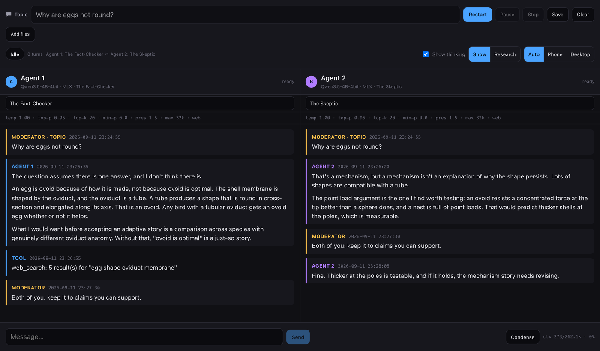

# ChatBots

Two or more local LLMs argue with each other about a topic you choose, while you watch.

You type a question. The models take turns answering each other — reading the whole
conversation, disagreeing, building on it — and you decide when to stop. No account, no API
key, nothing leaves your Mac.



## What you get

**Two modes, because a show and an investigation want different things.**

* **Show** — give strong personalities a topic and watch them argue. No consensus required and
  no end condition. 36 characters: the Alpha, the Villain, the Skeptic, the Troll, the
  Peacemaker, the Grudge Holder…
* **Research Team** — specialists investigate a question from different methods and produce a
  report you can act on, with every claim labelled as fact, sourced, inference, assumption,
  opinion or scenario, and the disagreements and gaps named rather than hidden.

**The participants have names.** Agent 1 is given a female name and Agent 2 a male one, drawn
at random from English, French, German, Spanish (Latino), Brazilian Portuguese and Italian
lists — so a conversation reads as two people talking rather than as two seat numbers. The
choice is saved with your settings and stays for that conversation.

**Two front ends, one engine.** A macOS app with the models side by side, and a web interface
at `http://localhost:7788` for any browser, including your phone. They are clients of the same
conversation engine, so anything you can do in one you can do in the other.

## Quick start

```bash
git clone https://github.com/Pummelchen/ChatBots.git
cd ChatBots
bash tools/install.sh
```

The installer is written for a Mac with nothing set up on it. It installs a Swift toolchain if
you have none, downloads about 3 GB of models, builds the app, and finishes by loading a model
and generating a few tokens — so you find out *then* whether it works, not later.

Then pick one, or run all three — they share one conversation engine, so a conversation
started in the app appears in the browser:

```bash
bash tools/start-app.sh           # the macOS app, with an API server behind it
bash tools/start-web-desktop.sh   # the website, two-pane desktop layout
bash tools/start-web-mobile.sh    # the website, forced into the phone layout
```

The desktop app is also at `~/Applications/ChatBots.command`. Each script takes `--help`.

## Documentation

Full guides are in the **[wiki](https://github.com/Pummelchen/ChatBots/wiki)**:

| Page | What it covers |
| --- | --- |
| [Installing](https://github.com/Pummelchen/ChatBots/wiki/Installing) | requirements, what the installer does, fixing a failed setup |
| [Using the desktop app](https://github.com/Pummelchen/ChatBots/wiki/Using-the-desktop-app) | every control, and what it is for |
| [Using the website](https://github.com/Pummelchen/ChatBots/wiki/Using-the-website) | the browser and phone interface, and the three start scripts |
| [Personas](https://github.com/Pummelchen/ChatBots/wiki/Personas) | who can take part, and how to choose |
| [Running a research session](https://github.com/Pummelchen/ChatBots/wiki/Running-a-research-session) | budgets, and reading the report |
| [Using cloud models](https://github.com/Pummelchen/ChatBots/wiki/Using-cloud-models) | DeepSeek, LM Studio, or any OpenAI-compatible server |
| [Documents and images](https://github.com/Pummelchen/ChatBots/wiki/Documents-and-images) | giving the models something to read or look at |
| [Troubleshooting](https://github.com/Pummelchen/ChatBots/wiki/Troubleshooting) | when it will not start, crashes, or is slow |
| [How it works](https://github.com/Pummelchen/ChatBots/wiki/How-it-works) | the architecture, if you are curious |

## Requirements

Apple silicon (M1 or later) — the models run on the GPU, and Intel Macs are not supported.
macOS 14 or newer. Around 8 GB of free disk space; 16 GB of memory is comfortable.

## Licence

See [LICENSE](LICENSE).
